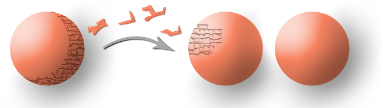

# 2. Events and Probabilities

## **The intuitive meaning**

### Model and Real world

$$
\begin{array}{|c|c|}\hline \text { \bf Probability Model } & \text { \bf Real-world interpretation }  \\ \hline  \text { Sample space } \Omega & \text { Set of all outcomes } \\ \hline  \text { Point } \omega \text { of } \Omega & \text { Possible outcome of experiment } \\ \hline  \text { (No counterpart) } & \text { Actual outcome } \omega^{\text {act }} \\ \hline  \text { Event } F, \text { 'measurable' } & \begin{array}{l}\text { The real-world event corresponding to } F \\  \text { subset of } \Omega\end{array} \\ \hline  \mathbb{P}(F) \text {, a number } & \begin{array}{l}\text { Probability that } F \text { will occur for an } \\  \text { experiment yet to be performed. } \end{array} \\ \hline  \end{array}
$$

### In the sense of mathematical language…

$$
\begin{array}{|c|c|}
\hline \text {\bf Event in Maths } & \text {\bf Real-world interpretation } \\
\hline \Omega \text {, the entire sample space } & \text { The certain event 'something happens' } \\
\hline \text { The empty subset } \emptyset \text { of } \Omega & \begin{array}{l}
\text { The impossible event 'nothing } \\
\text { happens' }
\end{array} \\
\hline \text { The intersection } F \cap G & \text { 'Both } F \text { and } G \text { occur' } \\
\hline F_1 \cap F_2 \cap \ldots \cap F_n & \begin{array}{l}
\text { 'All of the events } F_1, F_2, \ldots, F_n \\
\text { occur simultaneously' }
\end{array} \\
\hline \text { The union } F \cup G & \text { 'At least one of } F \text { and } G \text { occurs' } \\
\hline F_1 \cup F_2 \cup \ldots \cup F_n & \text { 'At least one of } F_1, F_2, \ldots, F_n \text { occurs' } \\
\hline \text { Complement } F^c \text { of } F & \text { ' } F \text { does not occur' } \\
\hline F \backslash G & \text { ' } F \text { occurs, but } G \text { does not occur' } \\
\hline F \subseteq G & \text { If } F \text { occurs, then } G \text { must occur } \\
\hline
\end{array}
$$

## Measurable

A bees-eye view: How insects see flowers very differently to us. 

$$
\begin{split}	\text{ Events} = 	\begin{cases}	 \text{black, purple, white,  yellow} \ &(\text{Human}) \\	\text{black, white, deep purple, green, yellow} \ &(\text{Bees}) 	\end{cases} 	\\ \rightsquigarrow \text{ ``Measurable'' sets are different on the same sample space!}			\end{split}
$$

## Measure theory*

Assuming the Axiom of Choice, it is not true that every subset can be measure! 

The area must be 1/2→1/4→…→0. This says that there exists a “non-measurable” events. In the general theory then, not all subsets of need be events. 

$\mathcal{F}$ is a a collection of measurable sets that satisfies sigma-algebra: 

<aside>
💡 Definition (algebra). Let $S$ be a set. A collection $\Sigma_0$ of subsets of $S$ is called an algebra on $S$ (or algebra of subsets of $S$ ) if

1. $S \in \Sigma_0$
2. $F \in \Sigma_0 \Rightarrow F^c:=S \backslash F \in \Sigma_0$
3. $F, G \in \Sigma_0 \Rightarrow F \cup G \in \Sigma_0$.
</aside>

<aside>
💡 Definition ( $\sigma$-algebra). A collection $\Sigma$ of subsets of $S$ is called a $\sigma$-algebra on $S$ (or $\sigma$-algebra of subsets of $S$ ) if $\Sigma$ is an algebra on $S$ such that whenever $F_n \in \Sigma(n \in \mathrm{N})$, then

$$
\bigcup_n F_n \in \Sigma .
$$

Thus, a pair $(S, \Sigma)$ is called measurable space.

</aside>

<aside>
💡 Definition (Probability measures). Let $(\Omega, \mathcal{F})$ be a measurable space.

1. $\mathbb{P}$ is a map from the domain $\mathcal{F}$ to the image $[0,1]$ and $\mathbb{P}(\Omega)=1$ holds.
2. For mutually exclusive sets $A_1, A_2, \cdots \subset \Omega$, that is, $i \neq j \Rightarrow A_i \cap A_j=\emptyset(i, j \in \mathbb{N})$,

$$
\mathbb{P}\left(\bigcup_{n=1}^{\infty} A_n\right)=\sum_{n=1}^{\infty} \mathbb{P}\left(A_n\right)
$$

Then, we say that $\mathbb{P}$ is a probability measure or a probability on $(\Omega, \mathcal{F})$. A triple

$(\Omega, \mathcal{F}, \mathbb{P})$ is called a probability measure space.

</aside>

<aside>
💡 Example (Finite set)
For finite set $\Omega$, we can adopt the algebra and sigma-algebra $\mathcal{F}$,

$$
\mathcal{F} = 2^{\Omega}
$$

</aside>

If you consider infinite set $\Omega$, we sometime faces  problem like Banach and Tarski’s Paradox. 

Usually, a probability triple is given by 

$$
(\Omega, \mathcal{F}, \mathbb{P})
$$

we can always set up an triple for the experiment which we wish to model in which is large enough to contain every event of which we could ever wish to find the probability.

---

### Almost surely*

A statement $S$ about outcomes is said to be almost surely true or to be true with probability 1 if the truth set $T$ of $S$, is an element of $\mathcal{F}$, and $\mathbb{P}(T)=1$.

<aside>
💡 Remark:
Do note that the probability of an almost sure event is exactly 1 , not $99.9 % or anything similar.

</aside>

- Random walk on $\mathbb{Z}$ staring from origin and consider a stopping time $\tau=\inf\{n \in \mathbb{N}: X_n=1\}$, then $\mathbb{P}(\tau<\infty)=1$.
- A statement a monkey typing ABRACADABRA with random is almost surely!
- Moreover, Monkey typing (complete) works of Shakespeare with random is almost surely!!

[Infinite monkey theorem](https://en.wikipedia.org/wiki/Infinite_monkey_theorem)